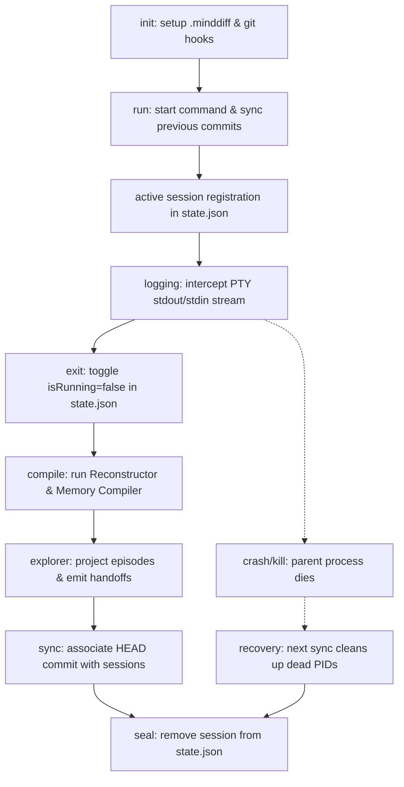

# MindDiff Architecture

This document describes the architecture, design principles, lifecycles, and roadmap of the MindDiff system. It is intended for contributors and AI agents to understand how MindDiff integrates with development workflows, processes developer context, and operates internally.

---

## MindDiff Philosophy

In modern engineering, generative AI dramatically increases code creation speed, but developer comprehension remains the primary bottleneck. The context behind AI refactors, debugging attempts, and architectural trade-offs is quickly lost.

MindDiff is a **Developer Continuity Engine** designed to preserve developer flow and understanding. It complements Version Control Systems (VCS) with the following philosophy:

* **Git records what changed**: The code states, chronology, and file snapshots.
* **MindDiff records why it changed**: The cognitive traces, interactive prompts, developer reasoning, and CLI tool output.

MindDiff's product promise is summarized in three core actions:

> **Remember. Understand. Continue.**

* **Remember accurately** (The Reconstructor): High-fidelity terminal stream processing captures what actually happened.
* **Understand what mattered** (The Memory Compiler): Logical filters extract semantic facts, intents, and constraints into a stable event ledger.
* **Continue where you left off** (The Memory Explorer): Context handoffs bridge session gaps, letting developers and agents pick up immediately.

---

## Three-Layer System Architecture

The MindDiff codebase is structured into three distinct, decoupled components with clear boundaries of responsibility:

```
[Raw PTY Stream] ──► [ 1. RECONSTRUCTOR ] (Remember)
                            │
                            ▼ (Cleaned Terminal Text)
                     [ 2. MEMORY COMPILER ] (Understand)
                            │
                            ▼ (Canonical memory.json)
                     [ 3. MEMORY EXPLORER ] (Continue)
                            │
                            ├─► Narrative View (Default 'view' UX)
                            └─► Handoff Generator (handoff.json / handoff.md)
```

### 1. The Reconstructor
Processes raw pseudo-terminal streams to rebuild exactly what the developer saw, without the terminal protocol noise.
* **Horizontal Rewriting**: Resolves carriage returns (`\r`) by resetting the write pointer on a line buffer, collapsing high-frequency progress indicators.
* **Vertical Backstepping**: Interprets basic cursor movements (e.g. `\u001b[A` for cursor-up) to update specific lines in history.
* **Cleaning**: Strips ANSI colors, text decorations, and control sequences.
* **Collapsing**: Drop transient spinner keyframes and identical consecutive snapshots to isolate meaningful text updates.

### 2. The Memory Compiler
Processes reconstructed, cleaned transcripts to identify core semantic events and build a canonical timeline ledger.
* **Fact and Constraint Detection**: Extracts commands, exit codes, and explicit exceptions (linter/test errors).
* **Cognitive Inference**: Parses agent thinking blocks to infer high-level intent and assigns tags (e.g. planning, debugging, triage).
* **Storage Emission**: Writes a sequence of atomic `MemoryBlock` elements to the stable, version-controlled `<session-id>.memory.json` ledger.

### 3. The Memory Explorer
The user experience and continuity delivery layer.
* **Semantic Episode Projection**: Groups low-level memory blocks into cognitive episodes mapping to the cycle:
  $$\text{Intent} \longrightarrow \text{Action(s)} \longrightarrow \text{Outcome} \longrightarrow \text{Reflection}$$
* **Narrative Presentation**: Projects episodes into a human-friendly narrative timeline (served as the default output for `minddiff view`).
* **Handoff Generation**: Creates a structured, machine-readable `<session-id>.handoff.json` and a human-readable `<session-id>.handoff.md` detailing what was accomplished, what is left unfinished, active files, and blockers.

---

## Database Architecture

All MindDiff databases and configurations live in the `.minddiff/` directory at the project root. This forms the repository-local, append-only database of cognitive logs:

```
.minddiff/
├── sessions/
│   ├── session-<id>.log           # Raw PTY byte capture
│   ├── session-<id>.json          # Session metadata (Agent, creation date, Git commits)
│   ├── session-<id>.memory.json   # Canonical flat memory ledger (MemoryBlocks)
│   ├── session-<id>.handoff.json  # Machine-readable handoff state
│   └── session-<id>.handoff.md    # Universal human-readable context summary
├── commits/
│   └── <git-commit-sha>.json      # Linked Git commit metadata
├── state.json                     # Active session registration
└── state.json.lock                # Concurrency synchronization lock
```

---

## Handoff & Resume Specification

The killer feature of MindDiff is the **Handoff & Resume** loop, which bridges development sessions over time.

### Handoff Data Model (`.handoff.json`)
At the end of every session, the Memory Explorer generates a structured handoff:
```json
{
  "sessionId": "session-2026-07-01-abc4",
  "agent": "gemini",
  "args": ["run", "build"],
  "lastGoal": "Clean up TTY escape sequences in compiler reconstruction",
  "accomplished": [
    "Refactored passes/clean.ts to filter double carriage returns",
    "Added unit tests for cursor-up sequences"
  ],
  "unfinished": [
    "Verify spinner keyframe collapsing under heavy CPU load"
  ],
  "blockers": [
    "Prebuild binary for node-pty lacks execution bit on macOS Arm64"
  ],
  "activeFiles": [
    "src/compiler/passes/reconstruct.ts"
  ]
}
```

### The Resume Flow
When the developer resumes work:
1. They execute: `minddiff resume`.
2. The Explorer locates the most recent session, reads the corresponding `.handoff.json`, and outputs a clean markdown summary in the terminal.
3. The Explorer generates/updates `.minddiff/handoff.md` as a universal reference.
4. The user is prompted: `Ready to resume using 'gemini'? [Y/n]`. Upon confirmation, the agent is spawned wrapping the previous context.

---

## Session Lifecycle

MindDiff manages active sessions using a state machine with the following lifecycle phases:



1. **`init`**: Configures the project workspace, setting up directory folders and installing the Git `post-commit` hook.
2. **`run`**: Runs a sync check, registers the session in `state.json` with active process IDs, and launches the agent inside the intercepted PTY.
3. **`logging`**: Pipes PTY output to stdout while writing raw bytes to the `.log` capture file.
4. **`exit & compilation`**: When the session exits, the running status toggles to `false`. The Reconstructor cleans the terminal stream, and the Memory Compiler emits the stable `<session-id>.memory.json`.
5. **`explorer processing`**: The Explorer analyzes the memory ledger, extracts episodes, and writes the `handoff` json and md assets.
6. **`commit synchronization`**: Associates any Git commits made during the session.
7. **`sealing & recovery`**: Removes the session from `state.json` (or self-heals crashed PIDs on subsequent runs).

---

## Git Synchronization

MindDiff treats Git as the canonical timeline of code changes. To bridge sessions and commits without guessing, MindDiff implements a deterministic mapping model:

* **Many commits per session**: AI conversations often span multiple commits. MindDiff maps sessions to multiple commits chronologically.
* **Bidirectional Mapping**: 
  - Commits contain `associatedSessions` arrays in `.minddiff/commits/<SHA>.json`.
  - Sessions track all linked commits inside their `.json` metadata file.
* **Synchronization Trigger**: Commits are associated when they occur (detected by the `post-commit` hook) or on CLI execution start/stop. The sync engine writes commit JSON metadata and updates session files accordingly.

---

## Agent Architecture

MindDiff utilizes the **Adapter Pattern** to remain entirely agent-agnostic. The core runtime manages PTY streams and state files, while agents are modeled as implementations of the `Agent` interface:

```typescript
export interface Agent {
  name: string;
  command: string;
  execute(args: string[], logStream: WriteStream): Promise<number>;
}
```

Adding support for tools like **Gemini**, **Claude**, **GitHub Copilot**, **Aider**, or custom CLI agents requires implementing an adapter in the registry rather than modifying the core stream and state runtime.

---

## Design Principles

Our implementation follows these strict design guidelines:

1. **Deterministic over Heuristic**: No guessing timestamps or using buffers to map sessions to commits. Workflows are tracked via explicit state registers.
2. **Simplicity over Complexity**: Leverage projections to output complex data structures (like Episodes) dynamically while keeping the underlying storage schema (`memory.json`) simple and flat.
3. **CLI as a Product**: Human consumption is prioritized. Commands like `view` render readable, chronological narratives by default, hiding raw database logs.
4. **Graceful Self-Healing**: Stale locks and crashed processes are detected and repaired automatically on any CLI invocation.
5. **Preserve Raw Data before Parsing**: Capturing the raw PTY byte stream is prioritized over parser logic, guaranteeing a high-fidelity source of truth.

---

## Roadmap

### Phase 1 (Completed) ✅
* Transition database structure to `.minddiff/` layout.
* Implement deterministic session state mapping and Git synchronization.
* Create agent adapter abstractions for multi-agent CLI capability.
* Add crash-safe self-healing and concurrency locking.

### Phase 2 (Upcoming V1 Core)
* **Reconstructor**: Implement carriage return (`\r`) collapsing, basic cursor-up/down interpreting, and ANSI sequence stripping.
* **Memory Compiler Refactor**: Adapt the compiler to ingest reconstructed text and output the canonical `memory.json`.
* **Memory Explorer**: Build the Episode Projection pipeline, replace `minddiff view` with the default Narrative Story presentation, and generate `.handoff.json` and `.handoff.md` summaries.

### Phase 3 (Future Continuity & Search)
* **Continuity Engine**: Implement `minddiff resume [session-id]` command hooks.
* **Semantic Search**: Index and query cognitive files, commits, and memory blocks.
* **Developer Knowledge Graph**: Link cognitive paths across branches, issues, and files.
