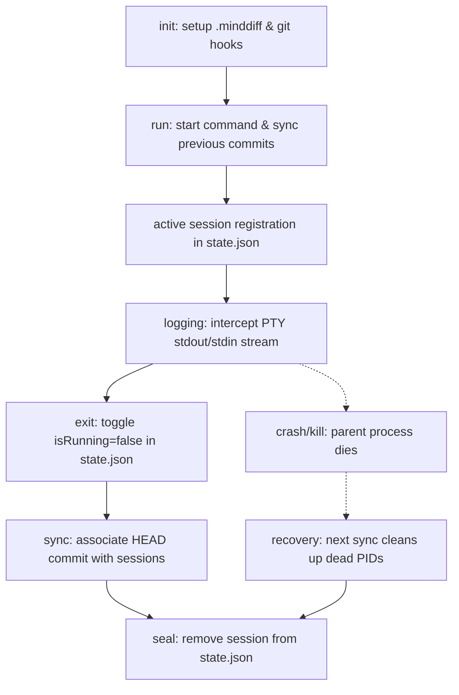

# MindDiff Architecture

This document describes the architecture, design principles, lifecycles, and roadmap of the MindDiff system. It is intended for contributors and AI agents to understand how MindDiff integrates with development workflows and operates internally.

---

## MindDiff Philosophy

In modern engineering, generative AI dramatically increases code creation speed, but developer comprehension remains the primary bottleneck. The context behind AI refactors, debugging attempts, and architectural trade-offs is quickly lost.

MindDiff is designed as an observability and continuity layer. It complements Version Control Systems (VCS) with the following philosophy:

* **Git records what changed**: The code states, chronology, and file snapshots.
* **MindDiff records why it changed**: The cognitive traces, interactive prompts, developer reasoning, and CLI tool output.

MindDiff does not replace Git; it enriches it. Rather than maintaining an independent developer history, MindDiff attaches cognitive timelines directly to the repository’s Git commits, establishing a unified understanding of repository evolution.

---

## Database Architecture

All MindDiff databases and configurations live in the `.minddiff/` directory at the project root. This structure forms the repository-local, append-only database of cognitive logs:

```
.minddiff/
├── sessions/
│   ├── session-YYYY-MM-DDTHH-MM-SS-mmmZ-rand.log
│   └── session-YYYY-MM-DDTHH-MM-SS-mmmZ-rand.json
├── commits/
│   └── <git-commit-sha>.json
├── summaries/
├── index/
├── config/
│   └── config.json
└── state.json
```

### Purpose of Database Components

* **`sessions/`**: Holds raw interactive session data.
  * **`.log` files**: Capture the raw interactive PTY byte stream (including terminal formatting and ANSI escape codes) for high-fidelity terminal replays.
  * **`.json` files**: Contain metadata about the session (agent name, command arguments, creation timestamp, and associated commits).
* **`commits/`**: Contains metadata for Git commits associated with MindDiff sessions (SHA, commit message, timestamp, list of files changed, and associated session IDs).
* **`summaries/`**: (Reserved) Output directory for future parsed semantic reasoning, cleaned markdown, and summaries.
* **`index/`**: (Reserved) Local search indexes.
* **`config/`**: Directory for project-specific settings and parameters.
* **`state.json`**: The active session state registry. It tracks which agent sessions are running or recently completed in the current workspace, along with their process IDs (PIDs) to handle race-conditions and crash-healing.

*Note: This layout replaces the legacy `./minddiff/logs` folder to separate internal database structures from public directories and support structured metadata mapping.*

---

## Session Lifecycle

MindDiff manages active sessions using a state machine with the following lifecycle phases:



1. **`init`**: Configures the project workspace. It creates the `.minddiff` folder structure and installs the `post-commit` hook to automate Git integration.
2. **`run`**: Runs a sync check to catch up on any manual offline commits, creates a new session log and metadata file, and starts the agent CLI within an intercepted PTY.
3. **`active session registration`**: Adds the new session ID to `.minddiff/state.json` with `isRunning: true` and its process ID (`pid`).
4. **`logging`**: Pipes PTY stdout/stdin to the terminal and appends raw bytes to the `.log` session file.
5. **`commit synchronization`**: Automatically triggered during runs or when a commit is created. It maps new commits to active sessions.
6. **`sealing`**: When a session exits, `isRunning` is set to `false`. Once the post-session commit occurs and is synchronized, the session is removed (sealed) from `state.json`.
7. **`crash recovery`**: If a CLI agent process dies abruptly, the session remains registered as running in `state.json`. On the next CLI run or sync call, MindDiff checks the registered PIDs. Dead processes are detected (`isPidAlive` returns `false`), and their sessions are automatically sealed.

---

## Git Synchronization

MindDiff treats Git as the canonical timeline of code changes. To bridge sessions and commits without guessing, MindDiff implements a deterministic mapping model:

* **Many commits per session**: AI conversations often span multiple commits. MindDiff maps sessions to multiple commits chronologically.
* **Bidirectional Mapping**: 
  - Commits contain `associatedSessions` arrays in `.minddiff/commits/<SHA>.json`.
  - Sessions track all linked commits inside their `.json` metadata file.
* **Synchronization Trigger**: Commits are associated when they occur (detected by the `post-commit` hook) or on CLI execution start/stop. The sync engine writes commit JSON metadata and updates session files accordingly.

---

## Current Multi-Session Policy

MindDiff supports concurrent session tracking (e.g. running Gemini in one terminal and Claude in another).

* **Current Policy (v1)**: If multiple agent sessions are running concurrently in the same repository, a new commit is associated with **all** currently active sessions.
* **Trade-off and Rationale**: This is a v1 simplification. If a developer uses multiple agents in parallel, their unified contribution is represented in the commit.
* **Future Optimizations**: Future versions may refine this by tracking working directory scopes, branches, or actual file write activity to attribute commits to specific agent sessions.

---

## Agent Architecture

MindDiff utilizes the **Adapter Pattern** to remain entirely agent-agnostic. The core runtime manages PTY streams and state files, while agents are modeled as implementations of the `Agent` interface:

```typescript
export interface Agent {
  name: string;
  command: string;
  execute(args: string[], logStream: WriteStream): Promise<number>;
}
```

Adding support for tools like **Gemini**, **OpenAI Codex**, **Claude**, **GitHub Copilot**, **Aider**, or custom CLI agents requires implementing an adapter in the registry rather than modifying the core stream and state runtime.

---

## Design Principles

Our implementation follows these strict design guidelines:

1. **Deterministic over Heuristic**: No guessing timestamps or using buffers to map sessions to commits. Workflows are tracked via explicit state registers.
2. **Git is the Source of Truth**: Git dictates when milestones occur; MindDiff enriches those milestones.
3. **Explicit State over Inferred State**: Active sessions are written directly to `state.json` rather than inferred from directory listings.
4. **Graceful Self-Healing**: Stale locks and crashed processes are detected and repaired automatically on any CLI invocation.
5. **Extensibility before Optimization**: Code paths (like agent registries) are decoupled to accommodate future multi-agent workflows.
6. **Preserve Raw Data before Parsing**: Capturing the raw PTY byte stream is prioritized over parser logic, guaranteeing a high-fidelity source of truth.

---

## Known Limitations (v1 Roadmap Items)

The following behaviors are intentional limitations of the v1 architecture, which will be addressed in future phases:

* **Coarse Multi-Session Mapping**: Commits associate with all active sessions instead of using fine-grained file-level tracking.
* **Unstructured Terminal Logs**: Sessions store raw ANSI terminal streams which contain escape codes, making them optimal for replays but difficult to view in standard text editors.
* **No Reasoning Extraction**: Cognitive reasoning traces are not yet separated from terminal output.
* **Missing Summaries & Search**: Semantic summaries, knowledge graphs, and cross-session search are not yet implemented.

---

## Roadmap

### Phase 1 (Completed) ✅
* Secure OIDC GitHub Actions publication pipeline.
* Transition database structure to `.minddiff/` layout.
* Implement deterministic session state mapping and Git synchronization.
* Create agent adapter abstractions for multi-agent CLI capability.
* Add crash-safe self-healing and concurrency locking.

### Phase 2 (Upcoming)
* **Parser Redesign**: Strip terminal escape characters, handle ANSI redraws, and extract clean text.
* **Log Cleaning**: Separate user inputs from agent responses.
* **Reasoning Extraction**: Segment and structure the cognitive logs.

### Phase 3 (Future)
* **Summarization**: Generate markdown summaries of sessions and commits.
* **Semantic Search**: Search repository history, commits, and cognitive reasoning traces.
* **Visual Replays**: Replay terminal sessions directly from logs.
* **Developer Knowledge Graph**: Link cognitive paths across branches and files.
